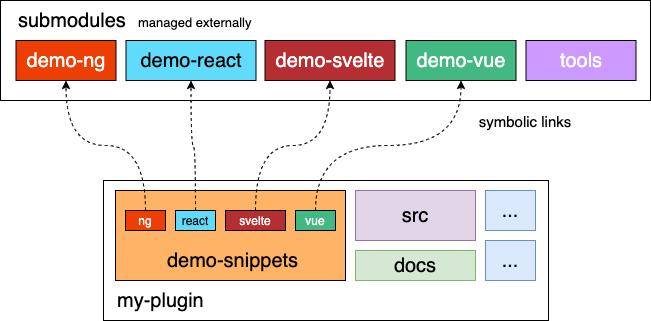
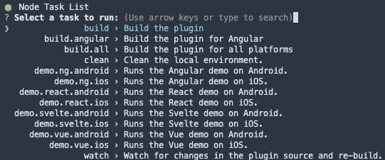
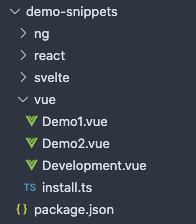

# NativeScript Community Plugin Seed

This is a repo for the NativeScript Community plugin seed. Its goal is to standardize and streamline the plugin development of community plugins. This is an alternative to NativeScript's monorepo plugin seed. 

This plugin seed contains demos (Angular, Vue, Svelte, and React), documentation generation, and release management w/ Lerna.

You must clone this repo recursively to download the submodules as well.
```
git clone https://github.com/nativescript-community/plugin-seed.git --recursive
```

|  |
| --- |
| Plugin Seed Project Structure |
## Table of Contents
1. [Development](#development)
2. [Demos](#demos)
3. [Tools](#tools)
4. [Docs](#docs)
5. [Community Website](#community-website)
6. [README Template](#readme-template)
7. [Contribution Guide](#contribution-guide)

## Development

To build the plugin's source code and run demos use the following steps:

## Install Dependencies:
```bash
npm i # or 'yarn install' or 'pnpm install'
```

### Interactive Menu:
To start the interactive menu, run `npm start` (or `yarn start` or `pnpm start`). This will list all of the commonly used scripts.



### Building Plugin:
```bash
npm run build

# or for Angular
npm run build.angular
```

### Running Demos:
```bash
npm run demo.[ng|react|svelte|vue].[ios|android]

# Example:
npm run demo.svelte.ios
```

### Automatic Redirect
In some cases, you might want to be redirected to a specific demo every time the app starts. This can be done by adding a `--env.redirect=[demo_name]` to the run demo command.

The `[demo_name]` comes from whatever the demo's `path` is that is defined in the framework's `install.ts` script.

For example, the Vue demo snippet's `install.ts` contains the following demos:
```ts
export const demos = [
    { name: 'Demo 1', path: "demo1", component: Demo1 },
    { name: 'Demo 2', path: "demo2", component: Demo2 },
    { name: 'Development', path: "development", component: Development }
];
```
This means you can set `[demo_name]` to `demo1`, `demo2`, or `development`.
## Demos

### Structure


As stated aboved, there is a demo for each framework: Angular, Vue, Svelte, and React. Each demo flavor is a Git submodule and the actual demo code is not meant to edited directly, but rather there are demo snippets for each flavor that will be linked to the demos. This allows for significantly simplier maintenance for developers.


The demo template has a menu system that allows for the ability to show off multiple examples of the plugin in an organized way. 

There is also a dedicated development demo which is a workspace for the development of the plugin. Sometimes in development there are special cases and obscure things you need to test, but don't need to be shown in the "show-off" demos. 

The non-development demos should be for new users testing out the plugin to see the capabilities and understand how it works. These should *ideally* be the same across all demos.

### Snippets



The `demo-snippets` directory contains the specific demo code for the plugin. Each component is essentially another demo page. Each framework directory has a `install.ts` file which will allow you at add any specific code that needs to be ran in the top-level of the demo. This is also where you register what components you want to be added to the demo.

There is also a `package.json` inside the `demo-snippets` directory. This allows you to add (or modify) any dependencies you need to be added to the demos.

## Tools

There is a linked submodule called `tools`. This contains utility scripts that can be ran on the plugin. 

### Setup Plugins
`setup.js` is used to link the plugin's demo snippets to the actual demo code. This script is ran from each demo's `preinstall` script in their `package.json`.

### Sync
`sync.js` is used to update the `dependencies`, `devDependencies`, and `scripts` portions of the `package.json` in order to match the "template" `package.json` (`./tools/package.json`). This is used to quickly and easily update plugins and keep a common set of dependencies. That can also be ran with `npm run sync` (or `npm run sync.test` for a dry-run).


## Community Website

Publishing your plugin on the [NativeScript Community Website](https://nativescript-community.github.io/) is as simple as publishing under the `@nativescript-community` scope and modifying your `plugin/package.json` file. 

See the following image to understand what fields in the `package.json` correspond to the parts of the website.


## README Template

A boilerplate README for youl plugin is located [here](README_TEMPLATE.md). Rename this file to just `README.md` to make it your actual readme and update it with your plugin's content.

## Contribution Guide

A basic contribution guide for your plugin is located [here](CONTRIBUTING.md).