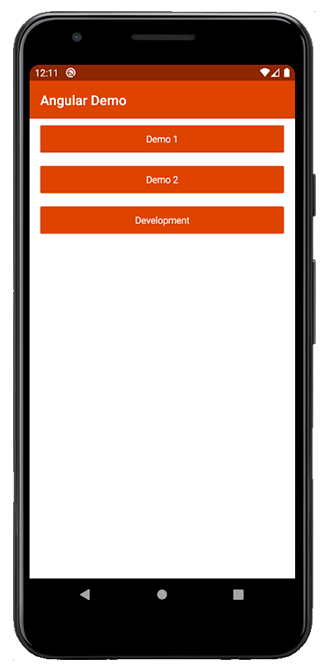

# NativeScript Plugin Name

[](https://www.npmjs.com/package/@nativescript-community/plugin-name)
[](https://www.npmjs.com/package/@nativescript-community/plugin-name)
[](https://www.npmjs.com/package/@nativescript-community/plugin-name)

Description of your plugin.

|  |  |
| --- | ----------- |
| iOS Demo | Android Demo |

---
## Table of Contents
1. [Installation](#installation)
2. [Configuration](#configuration)
3. [API](#api)
4. [Usage](#usage)
5. [Usage in Angular](#usage-in-angular)
6. [Usage in Vue](#usage-in-vue)
7. [Usage in Svelte](#usage-in-svelte)
8. [Usage in React](#usage-in-react)
9. [Contribute](#contribute)
10. [Demos](#demos)

## Installation
Run the following command from the root of your project:

`ns plugin add @nativescript-community/plugin-name`

## Configuration

Add any other additional configuration instructions here.

## API

List any API events, properties, and methods for your plugin.
### Events

### Properties

### Methods

## Usage in Angular

Show example of a simple use case of your plugin in an Angular app.

## Usage in Vue

Show example of a simple use case of your plugin in an Vue app.

## Usage in Svelte

Show example of a simple use case of your plugin in an Svelte app.

## Usage in React

Show example of a simple use case of your plugin in an React app.

## Demos
This repository includes Angular, Vue.js, Svelte, and React demos. In order to run these execute the following in your terminal:

Install Dependencies:
```bash
npm i # or your preferred package manager's install command
```

Run Setup:
```bash
npm run setup
```

Building Plugin:
```bash
npm run build

# or for Angular
npm run build.angular
```

Setup Demos:
```
npm run demo.setup
```

Running Demos:
```bash
npm run demo.[ng|react|svelte|vue].[ios|android]

# Example:
npm run demo.svelte.ios
```

## Contribute
We love PRs! Check out the [contributing guidelines](CONTRIBUTING.md). If you want to contribute, but you are not sure where to start - look for issues labeled help wanted.

## Questions

If you have any questions/issues/comments please feel free to create an issue or start a conversation in the [NativeScript Community Slack Channel](https://nativescriptcommunity.slack.com/).

